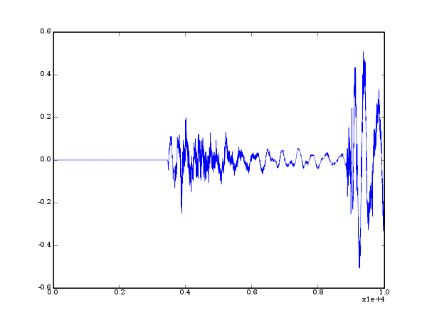

..
    restindex
        page-title: audiolab
        crumb: audiolab
        link-title: audiolab
        encoding: utf-8
        output-encoding: None 
        file: audiolab1.png
        file: quick1.py
        file: usage1.py
        file: usage2.py
        file: format1.py
        file: format2.py
        file: write1.py
        file: matlab1.py
        file: audiolab.pdf
    /restindex

.. vim:syntax=rest
.. Last Change: Tue Jul 17 11:00 AM 2007 J

===============================================================
 Pyaudiolab, a python package to make noise with numpy arrays
===============================================================

Introduction
============

.. _scipy: http://www.scipy.org
.. _libsndfile: http://www.mega-nerd.com/libsndfile/

For people doing audio processing, it is useful to be able to import data from
audio files, and export them back, as well as listening to the results of some
processing; matlab have functions such as wavread, wavwrite, soundsc, etc...
for that purposes.  The goal of audiolab is to give those capabilities to the
`scipy`_ environment by wrapping the excellent library `libsndfile`_ from Erik
Castro de Lopo. Pyaudio supports all format supported by libsndfile, including
wav, aiff, ircam files, and flac (an open source lossless compressed format);
see `here <http://www.mega-nerd.com/libsndfile/#Features">`_ for a complete
list.

    **Note**: The library is still in beta stage: reading and writing 
    data is possible, but only in frames, not per item.
    Also, the ability to play data on the system's soundcard is not there yet.
    I have never encountered any data corruption, except when using the buggy
    ctypes included in Ubuntu's python 2.5 (bug which was solved recently).

    **Note**: The online version of this document is not always up to date. The
    pdf included in the package is the reference, and always in sync with the
    package. If something does not work, please refer first to the pdf included in
    the package.

.. contents:: Tables of contents

Download and installation
=========================
                
Download
--------

audiolab is part of scikits: its source can be downloaded directly from the
scikits svn repository: svn co http://svn.scipy.org/svn/scikits/trunk/audiolab

Requirements
------------

audiolab requires the following softwares:

 - a python interpreter.
 - libsndfile (including the header sndfile.h, which means linux users should
   download the libsndfile-dev package).
 - numpy (any version >= 1.0 should work).
 - ctypes (version >= 1.0.1)

Starting with version 2.5, python include ctypes in its standart library, so you
don't need to install ctypes separately in this case.

It has been run succesfully on the following platforms:

    - linux ubuntu (32 and 64 bits)
    - windows XP

I would be interested to hear anyone who succeesfully used it on other
plateforms (Mac Os X, solaris, etc...).

    **Note**: the ctypes used in python2.5 package in ubuntu (and maybe debian
    as well) *had* a nasty bug which makes it impossible to use 64 bits integers. You
    should NOT use this package with audiolab (importing audiolab should fail,
    but if the version is not correctly detected, you will have file corruption when
    writing data to audio files). Run the test to check everything is working (a
    test case tests this issue).

    `<https://launchpad.net/ubuntu/+source/python2.5/+bug/71914>`_

Installation
------------

For unix users, if libsndfile is installed in standart location (eg /usr/lib,
/usr/local/lib), the installer should be able to find them automatically, and
you only need to do a "python setup.py install". In other cases, you need to
create a file site.cfg to set the location of libsndfile and its header (there
are site.cfg examples which should give you an idea how to use them on your
platform).

For windows users: the library distributed by Erik Castro de Lopo cannot be
used directly; you need to follow the instructions given in libsndfile
distribution in the file README-precompiled-dll.txt. See also site.cfg.win32.

License
-------
            
audiolab is released under the LGPL, which forces you to release back the
modifications you may make in the version of audiolab you are distributing,
but you can still use it in closed softwares.

Quick view
==========

The following code shows you how to open a file for read, reading the first
1000 frames, and closing it:

.. raw:: html

    {mycolorize;input/softwares/audiolab/quick1.py}

.. raw:: latex

    \input{quick1.tex}

Usage
=====
            
Opening a file and getting its parameters
-----------------------------------------

Once imported, audiolab gives you access the sndfile class, which is the
class of audiolab use to open audio files. 
You create a sndfile instance when you want
to open a file for reading or writing (the file test.flac is included
in the audiolab package, in the test_data directory):
            
.. raw:: html

    {mycolorize;input/softwares/audiolab/usage1.py}

.. raw:: latex

    \input{usage1.tex}

Prints you the informations related to the file, like its sampling rate, 
the number of frames, etc... You can of course get each parameter 
individually by using the corresponding sndfile.get* accessors.

Importing audio data
--------------------

Now that we've opened a file, we would like to read its audio content, 
right ? For now, you can only import the data as floating point data, 
float  (32 bits) or double (64 bits). The function 
sndfile.read_frames read n frames,
where a frame contains a sample of each channel (one in mono, 2 in stereo,
etc...):

.. raw:: html

    {mycolorize;input/softwares/audiolab/usage2.py}

.. raw:: latex

    \input{usage2.tex}

The above code import 10000 frames, and plot the first channel using matplotlib
(see below). A frame holds one sample from each channel: 1000 frames of a stereo
file is 2000 samples. Each channel is one column of the numpy array. The read
functions follow numpy conventions, that is by default, the data are read as
double, but you can give a dtype argument to the function.

The format class
----------------

When opening a file for writing, you need to give various parameters related to
the format such as the file format, the encoding.  The format class is used to
create valid formats from those parameters  By default, the format class creates
a format object with file type wav, and 16 bits pcm encoding: 

.. raw:: html

    {mycolorize;input/softwares/audiolab/format1.py}

.. raw:: latex

    \input{format1.tex}

prints back "Major Format: AIFF (Apple/SGI), Encoding Format: U-Law"
and "Major Format: SF (Berkeley/IRCAM/CARL), Encoding Format: 32 bit float". 

To get a list of all possible file format and encoding, the function
supported_* are available:

.. raw:: html

    {mycolorize;input/softwares/audiolab/format2.py}

.. raw:: latex

    \input{format2.tex}

    **Note**: not all combination of encoding, endianness and format are possible.
    If you try to create a format with incompatible values, you will get an error
    while creating an instance of format.

Writing data to a file
----------------------

Opening a file for writing is a bit more complicated than reading; you need to
say which format you are requesting, the number of channels and the sampling
rate (in Hz) you are requesting; all thoses information are mandatory !  The
class format is used to build a format understable by libsndfile from
'user-friendly' values. Let's see how it works.

.. raw:: html

    {mycolorize;input/softwares/audiolab/write1.py}

.. raw:: latex

    \input{write1.tex}

Matlab-like API
---------------

audiolab also have a matlab-like API for audio IO. Its usage is as similar as it
can get using python:

.. raw:: html

    {mycolorize;input/softwares/audiolab/matlab1.py}

.. raw:: latex

    \input{matlab1.tex}

Known bugs:
===========

 - there seems to be a problem when using libsndfile fseek facilities with flac
   files (which are necessary for the functions flacread/flacwrite). The
   problem seems to be with libFLAC; for this reason, seek in flac files is not
   enabled by default for now. See FLAC_SUPPORT.txt for more informations.
    
TODO
====

audiolab is still in early stages. Before a release, I would like to implement the
follwings:

 - support (at least some) meta-data embedded in some audio files format.
 - support the libsndfile's error system
 - player on all major plateforms (at least linux/windows/max OS X)
